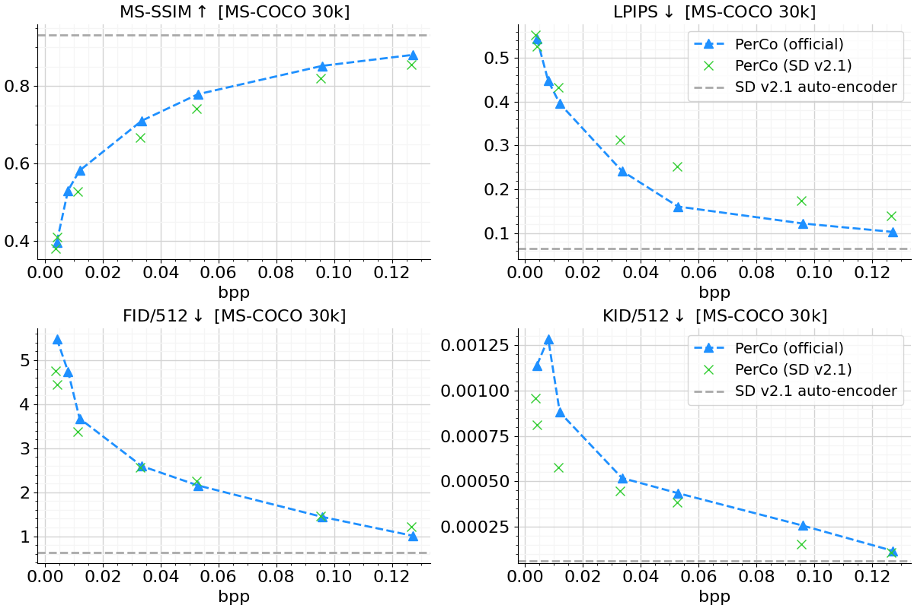

# Perceptual Compression (PerCo)

[](https://colab.research.google.com/drive/19IwzyVSTSMK-qQrzFBpV8PjCC10k1cTP?usp=sharing)

This repository provides a PyTorch implementation of PerCo based on:

- [Towards Image Compression with Perfect Realism at Ultra-Low Bitrates (ICLR 2024)](https://arxiv.org/abs/2310.10325).

<p align="center">
   
</p>

Different from the original work, we use [Stable Diffusion v2.1](https://huggingface.co/stabilityai/stable-diffusion-2-1) (Rombach et al., CVPR 2022) as latent diffusion model and hence refer to our work as PerCo (SD). This is to differentiate from the official work, which is based on a proprietary, not publicly available, pre-trained variant based on [GLIDE](https://arxiv.org/abs/2112.10741) (Nichol et al., ICML 2022).

Under active development.

## Updates

***05/24/2024***

1. Initial release of this project

## Visual Impressions

Visual Comparison on the [Kodak dataset](https://r0k.us/graphics/kodak/), for our lowest bit-rate (0.0019bpp). Column 1: ground truth. Columns 2-5: set of reconstructions that reflect the uncertainty about the original image source. 

<div align="center">
  
</div>

```python
Global conditioning: "a river runs through a forest with mountains in the background".
```

<div align="center">
  
</div>

```python
Global conditioning: "two parrots standing next to each other with leaves in the background".
```

More visual results can be found [here](./res/doc/figures).

## Quantitative Performance

In this section we quantitatively compare the performance of PerCo (SD v2.1) to the officially reported numbers. All models were trained using a reduced set of optimization steps (15k). Note that the performance is bounded by the LDM auto-encoder, denoted as SD v2.1 auto-encoder.

We generally find that PerCo (SD v2.1) provides competitive results with PerCo (official) for the ultra-low bit-rate setting (0.0019bpp), both in terms of distortion (MS-SSIM, LPIPS) and perception (FID, KID). 
As we approach the higher bit-rates, we observe that the performance gap grows - this could indicate that the use of local features produced by our [hyper_encoder_v2](/src/hyper_encoder_v2.py) has not yet reached its full potential. We believe that investigating different architectures (e.g. based on [SwinT-ChARM](https://openreview.net/pdf?id=IDwN6xjHnK8)) is a promising direction for future work. Also note that PerCo (official) was trained using 5 epochs (9M training samples / batch size 160 * 5 epochs = 281250 optimization steps) vs. 15k steps, which roughly corresponds to 5%.

We will continue our experiments and hope to release more powerful variants at a later stage.

<p align="center">
    
</p>


## Install

```bash
$ git clone https://github.com/Nikolai10/PerCo.git 
```

Please follow our [Installation Guide with Docker](./docker/install.txt).

## Training/ Inference/ Evaluation
Please have a look at the [example notebook](./notebooks/PerceptualCompression.ipynb) for more information.

We use the OpenImagesV6 training dataset by default, similar to [MS-ILLM](https://github.com/facebookresearch/NeuralCompression/tree/main/projects/illm). Please familiarize yourself with the data loading mechanisms (see [_openimages_v6.py](https://github.com/facebookresearch/NeuralCompression/blob/main/neuralcompression/data/_openimages_v6.py)) and adjust the file paths and training settings in [config.py](./src/config.py) accordingly. Corrupted images must be excluded, see [_INVALID_IMAGE_NAMES](https://github.com/Nikolai10/PerCo/blob/master/src/openimages_v6.py#L35) for more details.

We also provide a simplified Google Colab demo that integrates any [tfds](https://www.tensorflow.org/datasets/catalog/overview) dataset (e.g. CLIC 2020), with no data engineering tasks involved: [open tutorial](https://colab.research.google.com/drive/19IwzyVSTSMK-qQrzFBpV8PjCC10k1cTP?usp=sharing).

## TODOs

- [x] Compression functionality
    - [x] adopt script logic presented in [MS2020](https://github.com/tensorflow/compression/blob/master/models/ms2020.py)
    - [x] provide decompression functionality as [custom HuggingFace pipeline](https://github.com/huggingface/diffusers/blob/v0.26.3/src/diffusers/pipelines/stable_diffusion/pipeline_stable_diffusion.py)
    - [x] add zlib compression functionality (captions)
    - [x] add entropy coding functionality (hyper-encoder)
    - [x] use DDIM scheduler for inference (20/5 denoising steps)
- [x] Provide evaluation code/ compare quantitatively to PerCo (official)  
- [x] Training pipeline
    - [x] use [train_text_to_image.py](https://github.com/huggingface/diffusers/blob/main/examples/text_to_image/train_text_to_image.py) as starting point
    - [x] integrate tfds to make use of [Open Images v4](https://www.tensorflow.org/datasets/catalog/open_images_v4) (1.7M images)
    - [x] integrate full OpenImagesV6 (9M images) based on [NeuralCompression](https://github.com/facebookresearch/NeuralCompression) 
    - [x] obtain captions dynamically at runtime
    - [x] adjust conditioning logic (z_l, z_g)
    - [x] optimizer AdamW
        - [x] 5 epochs, on 512x512 crops (for now: limited to 15k iterations)
        - [x] peak learning rate ~~1e-4~~ -> we use 1e-5
        - [x] weight decay 0.01
        - [x] bs = 160 (w/o LPIPS), bs = 40 (w/ LPIPS)
        - [x] linear warm-up 10k
        - [x] train hyper-encoder + finetune linear layers of U-Net
        - [x] exchange traditional noise prediction objective with v-prediction
        - [x] add LPIPS loss for target rates > 0.05bpp  
    - [x] add classifier-free guidance (drop text-conditioning in 10% of iterations)
    - [x] override validation logic (add validation images)
- [x] BLIP 2
    - [x] add [Salesforce/blip2-opt-2.7b](https://huggingface.co/Salesforce/blip2-opt-2.7b) (and variants)
    - [x] max caption length 32 tokens 
- [x] Hyper-encoder
    - [x] request hyper-encoder design from authors
    - [x] integrate improved VQ-VAE functionality (Yu et al. ICLR 2022)   
    - [x] wrap into (ModelMixin, ConfigMixin) to make use of convenient loading/ saving
- [x] U-Net
    - [x] extend the kernel of the first conv layer
    - [x] initialize newly created variables randomly

**Note:** 
- we have not adjusted the finetuning grid to 50 timesteps as described in the paper. 
- we use a custom hyper-encoder based on HiFiC ([hyper_encoder_v2.py](./src/hyper_encoder_v2.py)), which for our setup provides more stable gradients compared to the official variant based on ELIC ([hyper_encoder.py](./src/hyper_encoder.py)). 
- we use [Stable Diffusion v2.1](https://huggingface.co/stabilityai/stable-diffusion-2-1) as LDM, due to its native shift from epsilon to v-prediction. In general, however, this project also supports SD 1.X variants with minor adjustments:
    ```bash
    from helpers import update_scheduler
  
    pipe = StableDiffusionPipelinePerco.from_pretrained(...)
    # add this line if you are using v-prediction
    update_scheduler(pipe)
    ```

## Pre-trained Models
Pre-trained models corresponding to 0.1250bpp, 0.0313bpp and 0.0019bpp can be downloaded [here](https://drive.google.com/drive/folders/11xHN61L7GqrJqEQbdtagbKBwMj1KZMf5?usp=sharing).

All models were trained using a DGX H100 using the following command:

```bash
# note that prediction_type must equal config.py prediction_type
!accelerate launch --multi_gpu --num_processes=8 /tf/notebooks/PerCo/src/train_sd_perco.py \
--pretrained_model_name_or_path="stabilityai/stable-diffusion-2-1" \
--validation_image "/tf/notebooks/PerCo/res/eval/kodim13.png" "/tf/notebooks/PerCo/res/eval/kodim23.png" \
--allow_tf32 \
--dataloader_num_workers=12 \
--resolution=512 --center_crop --random_flip \
--train_batch_size=20 \
--gradient_accumulation_steps=1 \
--num_train_epochs=5 \
--max_train_steps 15000 \
--validation_steps 500 \
--prediction_type="v_prediction" \
--checkpointing_steps 500 \
--learning_rate=1e-05 \
--adam_weight_decay=1e-2 \
--max_grad_norm=1 \
--lr_scheduler="constant" \
--lr_warmup_steps=10000 \
--checkpoints_total_limit=2 \
--output_dir="/tf/notebooks/PerCo/res/cmvl_2024"
```

If you find better hyper-parameters, please share them with the community.

## Directions for Improvement

- Investigate scalar quantizer + hyper-decoder (similar to [Agustsson et al. ICCV 2019](https://arxiv.org/abs/1804.02958))
- The authors only considered controlling the bit-rate via upper bound (i.e. uniform coding scheme); incorporating a powerful entropy model will likely exceed the reported performance.

## File Structure

     docker                                             # Docker functionality + dependecies
         ├── install.txt                                 
     notebooks                                          # jupyter-notebooks
         ├── FilterMSCOCO.ipynb                         # How to obtain MS-COCO 30k        
         ├── PerceptualCompression.ipynb                # How to train and eval PerCo                 
     res
         ├── cmvl_2024/                                 # saved model, checkpoints, log files
         ├── data/                                      # evaluation data (must be downloaded separately)
            ├── Kodak/                                  # Kodak dataset (https://r0k.us/graphics/kodak/, 24 images)
            ├── Kodak_gen/                              # Kodak reconstructions
            ├── MSCOCO30k/                              # MS-COCO 30k dataset (see ./notebooks/FilterMSCOCO.ipynb)
            ├── MSCOCO30k_gen/                          # MS-COCO 30k reconstructions
         ├── doc/                                       # addtitional resources
         ├── eval/                                      # sample images + reconstructions
     src
         ├── diffusers/                                 # local copy of https://github.com/huggingface/diffusers (v0.27.0)
         ├── compression_utils.py                       # CLI tools for PerCo compression/ decompression
         ├── config.py                                  # PerCo global configuration (training + inference)
         ├── helpers.py                                 # helper functionality
         ├── hyper_encoder_v2.py                        # hyper-encoder + quantization (based on HiFiC, slow but steady learning)
         ├── hyper_encoder.py                           # hyper-encoder + quantization (based on ELIC, unstable for our setup)
         ├── lpips_stable.py                            # stable LPIPS implementation based on MS-ILLM/ NeuralCompression
         ├── openimages_v6.py                           # minimalistic dataloader for OpenImagesV6
         ├── pipeline_sd_perco.py                       # custom HuggingFace Pipeline which bundles image generation (=decompression)
         ├── tfds_interface.py                          # simple PyTorch wrapper to make use of tfds
         ├── train_sd_perco.py                          # PerCo training functionality
         ├── unet_2d_perco.py                           # extended UNet2DConditionModel which accepts local features from the hyper-encoder


## Acknowledgment

This project is based on/ takes inspiration from:

- [Diffusers](https://github.com/huggingface/diffusers/tree/main/examples/text_to_image), a library for state-of-the-art pretrained diffusion models for generative AI provided by HuggingFace (Stable Diffusion).
- [Transformers](https://github.com/huggingface/transformers/tree/main/src/transformers/models/blip_2), a library for state-of-the-art machine learning models provided by HuggingFace (BLIP 2).
- [Vector Quantization - PyTorch](https://github.com/lucidrains/vector-quantize-pytorch), a vector quantization library (improved VQ-VAE).
- [TensorFlow Datasets (TFDS)](https://www.tensorflow.org/datasets/tfless_tfds), a collection of ready-to-use datasets (we make use of the TensorFlow-less NumPy-only data loading to access open_images_v4).
- [CompressAI](https://github.com/InterDigitalInc/CompressAI), a PyTorch library and evaluation platform for end-to-end compression research.
- [TensorFlow Compression (TFC)](https://github.com/tensorflow/compression), a TF library dedicated to data compression (we adopt the convenient script logic for compression/ decompression).
- [NeuralCompression](https://github.com/facebookresearch/NeuralCompression), a Python repository dedicated to research of neural networks that compress data (we make use of the stable LPIPS implementation + HiFiC-based building blocks).
- [torchac: Fast Arithmetic Coding for PyTorch](https://github.com/fab-jul/torchac) (we use torchac to compress the hyper-latent).

We thank the authors for providing us with the official evaluation points as well as helpful insights.

## Interested in Working with Me?

Feel free to reach out: nikolai.koerber@tum.de. I am particularly interested in PhD intern positions.

## License

[Apache License 2.0](LICENSE)